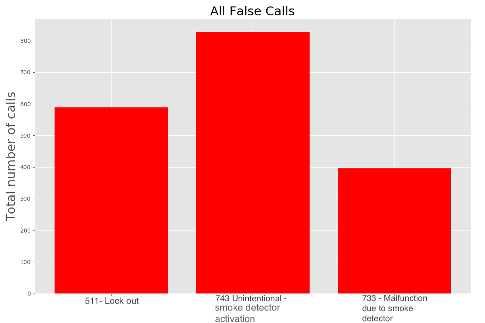

# Background & Motivation

[Addicted to Awake: Sleep Deprivation in the Fire Service](https://www.fireengineering.com/2018/11/15/196617/addicted-to-awake/#:~:text=This%20coincides%20with%20Barger's%20research,did%20not%20screen%20as%20positive.) dives into the reportings of the International Journal of Cancer who reported that the likelihood of a firefighter getting cancer goes up exponentitally when the indiviudal is sleep deprived. It has been found that sleep deprived women have a 40% increased risk of breast cancer and sleep deprived men have a 50 % increased risk of prostate and colorectal cancer. On top of an increase risk of cancer, the [Institute of Medicine (US) Committee on Sleep Medicine and Research](https://pubmed.ncbi.nlm.nih.gov/20669438/) reported that less than 7 hours of consecutive sleep leads to increase risk of cardiovascular disease, anxiety, depressed mood/alcohol use, obesity and diabetes.

The motivation for this project stemmed from two main sources. The first source was a very insightful conversation with an industry professinal at South Metro Fire & Rescue. During our conversation based on the dataset, we discussed the long term affects of waking firefighters up during the middle of the night for 9-11 response calls and more specifically for a 511 Lock-out call. 

The second main source of motivation for this project comes from my girlfriend being a new employee for South Metro Fire & rescue. Having little knowledge of the 9-11 industry this project allows me to become more informed on the day-to-day operations of the Fire & Rescue industry. 

-----------------------

# Data

The data used in this project comes directly from [South Metro Fire & Rescue](https://www.southmetro.org/) logs. Although the data is public information in order for to obtain this data a [Open records request](https://www.southmetro.org/467/Open-Records-Requests) must be completed. Following the request I was connected with a representative from SMFR who provided me aid.

The complete dataset consists of 42 different attributes of every 9-11 call recieved by SMFR during the 2019 year. For this analysis I cut the data down into 22 attributes with the most used attributes being x/y coordniates, Date time, and type of incident.

-------------------------------------------------------

# Exploratory Data Analysis
Beginning by importing and cleaning the data using `pandas`, my goal was to look at all the different tpyes of call recieved by SMFR. In order to look at these I pulled the top categories and filtered out the top four. 

Here we can see that the majority of the calls are Rescue, EMS calls, but highlited in red we can see a significant portion of 9-11 calls are categorized as False Alarm, False Call. 

To explore this False Alarm, False Call category more I had a conversation with the same SMFR employee. I wanted to know, what specific calls are avoidable or can be answered at a more ideal time. My goal was to show the number of times the department is recieving these "avoidable" calls. Through our conversation I chose three types of calls shown below.

Here, you can see a total of 1,813 "avoidable" calls. 

# Where are these calls occuring?
I wanted to get a better sense of where these calls were occuring. In order to determine if a call is a "nuisance" call or not the location is a major factor. To accomplish this, I specifically wanted to look at where these calls were happening during the middle of the night. 

| 511 lock Outs - Location                            | Count |
|--------------------------------------|-------|
| Vehicle Parking Area                 | 8     |
| Service station, gas station         | 3     |
| Multi-family residence               | 2     |
| Parking garage, general vehicle      | 2     |
| Residential street, road or driveway | 2     |

-------------------------------
| 743 Unintentional Smoke detector activation - Location| Count |
|---------------------------------------------|-------|
| 1 or 2 family residence                     | 39    |
| Multi-family residence                      | 21    |
| Business Office                             | 8     |
| 24-hour care Nursing Homes                  | 8     |
| Hotel/Motel, commercial                     | 7     |

--------------------------------------------------------

| 733 Malfunction to due smoke detector activation - Location| Count |
|--------------------------------------------------|-------|
| 1 or 2 family residence                          | 65    |
| Multi-family residence                           | 14    |
| Business Office                                  | 3     |
| 24-hour care Nursing Homes                       | 3     |
| Hotel/Motel, commercial                          | 2     |

------------------------------------------------------------------

First, you can see that the majority of the 5-11 Locks Out calls recieved during the night are from parking areas, parking garages, and gas stations. These locations are likely to be people returning to their cars after visiting an establishment that serves alcohol and thus, could be under the influence. 

Second, taking a look at 743 Uninentional Smoke detector activations. In the beginning I was skeptical about how are department could avoid such a call. I was informed that infact, some of these calls are avoidable or could be assigned less than the usual support. The main locations to look at here are 1 or 2 family residence or multi family residence. Unless there is a follow up call or a sense of immediate danger a 9-11 operator needs to be skeptical about these locations. 

Finally taking a look at 733 Malfunction calls due to smoke detector activation. These location are identical to the previous and should be judged accordingly. On a closing note, if a call is recieved from a commercial building or a follow up call is recieved immiedate action should be taken.

# What times are these calls occuring?

In attempt to get a better look at when exactly are these types of calls are occuring, I wanted to look at hour of day vs each different type of call. You can see these results below.

Noteable features here include spikes at rush hours in number of calls and more importantly the occurance of these calls happening during the night.

# Mapping False Calls

The main goal here is to look at clusters of these events. I wanted to identify specific locations that had repeated calls to. For example looking at our previous table, if there was a parking lot located near a downtown area that had multiple calls to, then a 9-11 operator would be able to identify this call and make an informed descison on how to handle it.

Looking at the gif generated below, you can see red clusters of data points. These red clusters would be examples of a possible chance to avoid a call and not assign any personell to.

# Conclusion

